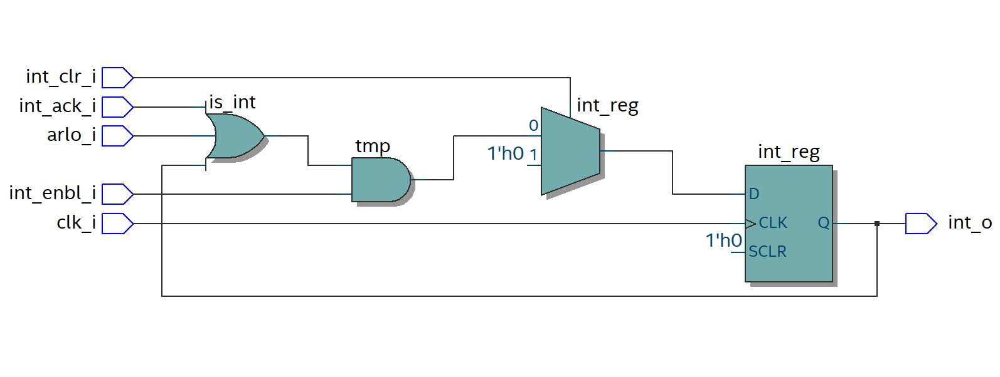

## Uvod

_Interrupt generator_ generiše _interrupt_ tako što na svom izlazu generiše visok, odnosno nizak logički nivo u slučaju da je došlo do prekida ili ne.

## Tabela portova

| Naziv porta      | Mod | Tip                                      | Opis                                                                                                                                              |
| ---------------- | --- | ---------------------------------------- | -------------------------------------------------------------------------------------------------------------------------------------------------                                                                                                                              |
| **clk_i**          | in   | std_logic                              | Ulazni takt
| **int_enbl_i**      | in  | std_logic                              | Ulazni signal za omogućenje prekida                                                                                                                  |
| **int_ack_i**      | in  | std_logic                              | Ulaz koji govori da li je primljena potvrda od slave-a                                   |
| **arlo_i**      | in  | std_logic  | Ulaz koji definiše da li je izgubljena arbitraža|
| **int_clr_i**     | in   | std_logic | Ulaz za ponistenje interrupt-a
| **int_o**       | out  | std_logic | Izlazni signal |

## Vremenska analiza

Maksimalna frekvencija kola je 141 MHz.
## _RTL_ prikaz

