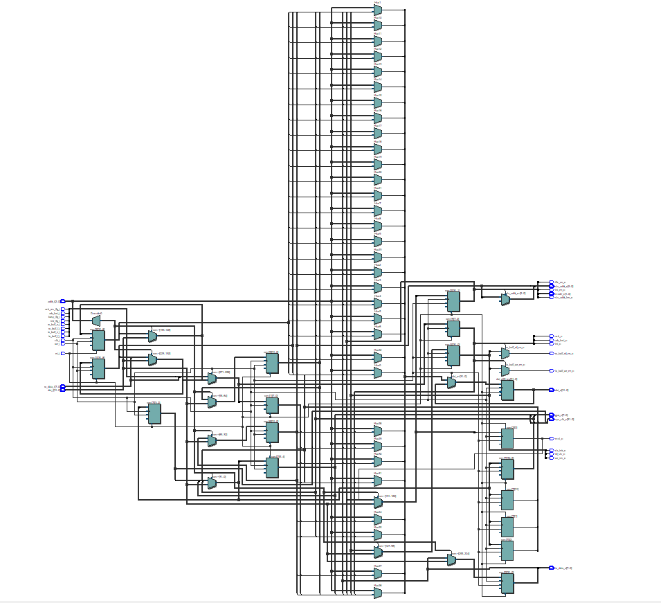
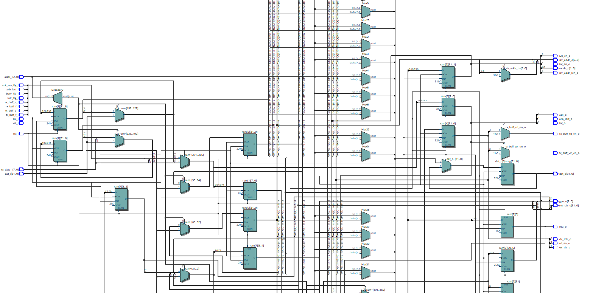

## Uvod

_Register Block_ sadrži sve registre koji sadrže kontrolne, komandne, statusne bite potrebne za ispravan rad sistema.

U sklopu registarskog bloka postoji ukupno 8 registara, svi registri su 32 bit-ni.

Svi biti u registrima, koji se upisuju preko posebnih ulaznih portova, se osvježavaju na rastuću ivici taktnog signala. Bitno je napomenuti da ako se u jednom ciklusu neki bit u nekom od registara osvježi, tek u sledećem ciklusu ta osvježena vrijednost se može pročitati iz registra.

## Tabela registara

| Naziv registra               | Adresa |
| ---------------------------- | :----: |
| **Tx registar**              |   0    |
| **Rx registar**              |   1    |
| **Kontrolni registar**       |   2    |
| **Statusni registar**        |   3    |
| **Komandni registar**        |   4    |
| **Registar adrese slave-a**  |   5    |
| **GPO registar**             |   6    |
| **Registar taktnog signala** |   7    |

## Tabela portova

| Naziv porta         | Mod | Tip                                             | Opis                                                                                                                                                                                                               |
| ------------------- | --- | ----------------------------------------------- | ------------------------------------------------------------------------------------------------------------------------------------------------------------------------------------------------------------------ |
| **clk_i**           | in  | std_logic                                       | Ulazni takt signal.                                                                                                                                                                                                |
| **rst_i**           | in  | std_logic                                       | Ulazni, asinhroni reset signal.                                                                                                                                                                                    |
| **stb_i**           | in  | stb_logic                                       | Ulazni port za omogućenje čitanja/pisanja                                                                                                                                                                          |
| **cyc_i**           | in  | std_logic                                       | Ulazni port koji govori da je transakcija validna                                                                                                                                                                  |
| **we_i**            | in  | std_logic                                       | Ulazni signal za selekciju čitanje/upis iz/u registre.   &emsp; 0 = Čitanje   &emsp; 1 = Upis                                                                                                              |
| **addr_i**          | in  | natural range 0 to 2g_ADDR_WIDTH - 1 | Adresa registra sa kojim se ostvaruje komunikacija. Širina ovog podatka zavisi od ukupnog broja registra. Ovaj dizajn ima osam registara.                                                                          |
| **dat_i**           | in  | std_logic_vector ((g_WIDTH - 1) downto 0)       | Ulazni port za podatke. Ako je **we_i** na jedinici, biti koji se dovode na ovaj port će se na prvu aktivnu ivicu taktnog signala upisati u registar koji je selektovan bitima koji se nalaze na portu **addr_i**. |
| **tx_buff_f_i**     | in  | std_logic                                       | Ulazni signal koji se dovodi sa predajnog **FIFO** bafera koji označava da li je predajni bafer pun.                                                                                                               |
| **tx_buff_e_i**     | in  | std_logic                                       | Ulazni signal koji se dovodi sa predajnog **FIFO** bafera koji označava da li je predajni bafer prazan.                                                                                                            |
| **rx_buff_f_i**     | in  | std_logic                                       | Ulazni signal koji se dovodi sa prijemnog **FIFO** bafera koji označava da li je prijemni bafer pun.                                                                                                               |
| **rx_buff_e_i**     | in  | std_logic                                       | Ulazni signal koji se dovodi sa prijemnog **FIFO** bafera koji označava da li je prijemni bafer prazan.                                                                                                            |
| **arb_lost_i**      | in  | std_logic                                       | Signal koji se dovodi sa generatora transakcija. Jedinica indicira da je uređaj izgubio arbitražu.                                                                                                                 |
| **ack_res_flg_i**   | in  | std_logic                                       | Signal koji se dovodi sa generatora transakcija. Označava da li je uređaj primio potvrdu od drugog uređaja sa kojim komunicira.                                                                                    |
| **busy_flg_i**      | in  | std_logic                                       | Signal koji se dovodi sa generatora transakcija. Jedinica na ovom ulazi znači da je _I2C_ transakcija u toku.                                                                                                      |
| **intr_flg_i**      | in  | std_logic                                       | Signal koji se dovodi sa generatora prekida. Jedinica na ovom ulazu znači da je prekid generisan.                                                                                                                  |
| **rx_data_i**       | in  | std_logic_vector (7 downto 0)                   | Na ovom portu se nalazi podaci koji se čitaju iz prijemnog bafera.                                                                                                                                                 |
| **ack_o**           | out | std_locic                                       | Izlazni signal potvrde.   &emsp; 0 = Potvrda primljena   &emsp; 1 = Potvrda nije primljena                                                                                                                 |
| **arb_lost_o**      | out | std_logic                                       | Izlazni signal kojim se govori da je arbitracija izgubljena. Ovaj bit se smješta u statusni registar.   &emsp; 0 = Arbitracija nije izgubljena   &emsp; 1 = Arbitracija je izgubljena                      |
| **int_o**           | out | std_logic                                       | Izlazni signal koji indicira da je prekid generisan.                                                                                                                                                               |
| **mode_o**          | out | std_logic_vector (1 downto 0)                   | Izlazni signal koji označava izabrani mod rada. Ovaj signal se izvodi iz kontrolnog registra.                                                                                                                      |
| **strt_o** | out | std_logic                  | Izlazni signal kojim se započinje _I2C_ transakcija.|
| **i2c_en_o**        | out | std_logic                                       | Izlazni signal omogućenja _I2C_ generatora transakcija.                                                                                                                                                            |
| **int_en_o**        | out | std_logic                                       | Izlazni signal omogućenja prekida.                                                                                                                                                                                 |
| **slv_addr_len_o**  | out | std_logic                                       | Izlazni signal koji označava dužinu _slave_ adrese uređaja, ukoliko uređaj radi u _slave_ modu.   &emsp; 1 = _10-bitna slave_ adresa   &emsp; 0 = _7-bitna slave_ adresa                                   |
| **msl_o**           | out | std_logic                                       | Signal koji određuje mod rada uređaja.   &emsp; 1 = _Master_ mod   &emsp; 0 = _Slave_ mode.   Podrazumijevani mod je _master_ mod.                                                                     |
| **tx_buff_wr_en_o** | out | std_logic                                       | Signal omogućenja upisa u predajni bafer.                                                                                                                                                                          |
| **rx_buff_rd_en_o** | out | std_logic                                       | Signal omogućenja čitanja iz prijemnog bafera.                                                                                                                                                                     |
| **rep_strt_o**      | out | std_logic                                       | Komandni signal koji se vodi na generator transakcija. Visok nivo na ovom signalu znači generisanje ponovnog starta (_Repeated start_).                                                                            |
| **clr_intr_o**      | out | std_logic                                       | Komandni signal koji se vodi na generator prekida. Visok nivo na ovom signalu znači naredbu čišćenja generisanog prekida.                                                                                          |
| **tx_data_o**       | out | std_logic_vector (7 downto 0)                   | Izlazni port podataka koji se upisuju u predajni bafer.                                                                                                                                                            |
| **gpo_o**           | out | std_logic_vector ((g_GPO_W - 1) downto 0)       | Izlazni signal opšte namjene.                                                                                                                                                                                      |
| **slv_addr_o**      | out | std_logic_vector (9 downto 0)                   | Adresa _slave_ uređaja. Koristi se ako uređaj radi u _slave_ modu.                                                                                                                                                 |
| **sys_clk_o**       | out | std_logic_vector ((g_WIDTH - 1) downto 0)       | Vrijednost sistemskog takta (System Clock Register)                                                                                                                                                                |
| **dat_o**           | out | std_logic_vector ((g_WIDTH - 1) downto 0)       | Izlazni signal podataka. Preko ovog porta _Wishbone Master_ čita vrijednost adresiranog registra.                                                                                                                  |

## Generičke konstante

| Naziv            | Tip     | Opis                                         |
| ---------------- | ------- | -------------------------------------------- |
| **g_WIDTH**      | natural | Broj bita u jednom registru.                 |
| **g_ADDR_WIDTH** | natural | Broj bita adrese.                            |
| **g_GPO_W**      | natural | Broj korisnih bita u registru opšte namjene. |

## Vremenska analiza

Na osnovu rezultata vremenske analize maksimalna frekvencija taktnog signala iznosi _133 MHz_.

## _RTL_ prikaz

